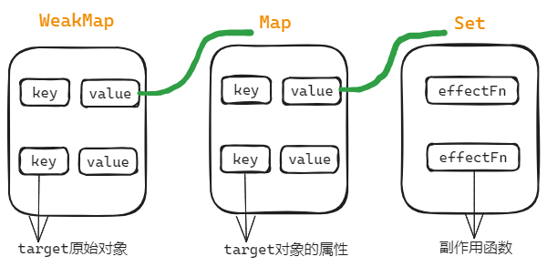
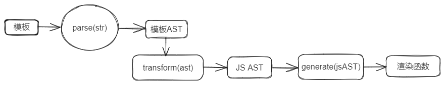
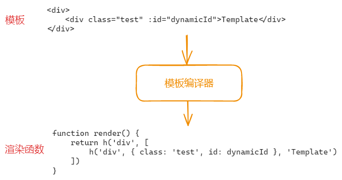

# Vue3 响应式系统和编译器初探

<div class="pt-12">
  <span @click="$slidev.nav.next" class="px-2 py-1 rounded cursor-pointer" hover="bg-white bg-opacity-10">
    Press Space for next page <carbon:arrow-right class="inline"/>
  </span>
</div>

<!--
The last comment block of each slide will be treated as slide notes. It will be visible and editable in Presenter Mode along with the slide. [Read more in the docs](https://sli.dev/guide/syntax.html#notes)
-->

---
layout: center
transition: fade-out
---

# 响应式系统

---
layout: default
---

## 什么是响应式？

考虑下面的代码:

```js
let a = 1
let b = 2
let sum = a + b

console.log(sum) // 3

a = 2
console.log(sum) // 还是 3
```

可以看到，修改 a 的值，sum 并没有自动发生任何改变，`sum = a + b` 并没有重新执行。

现在我们考虑将它包装成一个函数：

```js
function update() {
  sum = a + b
}
```

---
---

然后我们定义一些新术语:

- `update()`: 产生副作用的函数，简称副作用函数，它会修改了 sum 的状态
- `a` 和 `b`: 副作用函数的依赖

同时，假设还存在一个魔术方法 `whenDepsChange`，当依赖 a 和 b 发生变化时，重新执行 update 方法

```js
whenDepsChange(update)
```

完整伪代码如下:

```js
let sum
let a = 1
let b = 2
sum = a + b // 3
console.log(sum) // 3

whenDepsChange(function update() {
  sum = a + b
})
a = 10 // 修改 a 的值, 我们期待会重新执行 update 方法，并且 sum 的值变为 12
```

---
---

当然这一切都是做了一些假设的条件下才成立的，真实的 JavaScript 可没有魔术方法 `whenDepsChange`。

那我们可以使用 JS 语言的特性来实现这个魔术方法吗？

当然，接下来我们来了解下如何实现响应式数据。

---
layout: default
---

## 如何实现响应式数据

我们知道，在 ES6(ES2015) 之前，如果想拦截数据的读取和赋值操作，只能使用 `Object.defineProperty()` 将对象属性转换为 getter / setter 的形式，这也是 Vue2 所采用的方式，但是在 ES6+ 中，我们可以使用代理 `Proxy` 来实现对数据的拦截。

[简单了解下 Proxy & Reflect](https://w2xi.github.io/vue3-anaysis/proxy-and-reflect.html)

现在我们重新定义一些术语:

- 副作用函数 `effect`，即执行 `effect` 函数会产生副作用
- 响应式数据: 数据发生变化会自动执行副作用函数 `effect`

```js
// 执行 effect 会产生副作用
function effect() {
  document.body.innerText = 'hello vue3'
}
```

---
---

考虑下面的代码：

```js
const data = { text: 'Hello' }
const obj = new Proxy(data, {
  get(target, prop, receiver) {
    return Reflect.get(target, prop, receiver)
  },
  set(target, prop, value, receiver) {
    return Reflect.set(target, prop, value, receiver)
  }
})
function effect() {
  document.body.innerText = obj.text // 读取操作
}
// 执行副作用函数
effect() 
// 赋值操作
obj.text = 'Hello Vue3!'
```

现在问题变成: 当修改 `obj.text` 的值时，如何才能重新执行副作用函数 `effect` ?

---
---

假设有一个`桶`，当读取 `obj.text` 时，把副作用函数 `effect` 放入 `桶` 中；当修改 `obj.text` 时，把 `effect` 从 `桶` 中取出执行

```js {all|2|5|all}
function effect() {
  document.body.innerText = obj.text // 读取操作
}
effect() 
obj.text = 'Hello Vue3!' // 赋值操作
```

<arrow v-click="[1, 2]" x1="330" y1="170" x2="630" y2="280" color="#564" width="3" arrowSize="1" />


---
---

这就需要我们在拦截器中做处理，现在代码变成这样:

```js {all|6|11|all}
// demo: 01-how-to-build-reactivity-data.html
const bucket = new Set()
const data = { text: 'Hello' } 
const obj = new Proxy(data, {
  get(target, prop, receiver) {
    bucket.add(effect)
    return Reflect.get(target, prop, receiver)
  },
  set(target, prop, value, receiver) {
    const result = Reflect.set(target, prop, value, receiver)
    bucket.forEach(fn => fn())
    return result
  }
})
function effect() {
  document.body.innerText = obj.text
}
effect()
obj.text = 'Hello Vue3!'
```

---
---

但是，现在还有一些问题，比如: 副作用函数 `effect` 的名称是硬编码的，一旦修改就会导致代码不能正常工作，现在我们来修复这一点。

<div grid="~ cols-2 gap-2" m="t-2">

```js {1-8,11-14}
// 储存被注册的副作用函数
let activeEffect
// 用来注册副作用函数
function effect(fn) {
  activeEffect = fn
  // 执行副作用函数
  fn()
}
const obj = new Proxy(data, {
  get(target, prop, receiver) {
    if (activeEffect) {
      // 将副作用函数存储到桶中
      bucket.add(activeEffect)
    }
    // 省略其他代码
  },
  // 省略其他代码
})
```

```js {0|all}
// 测试一下效果:
// demo: 02-how-to-design-reactivity-system.html
effect(() => {
  document.body.innerText = obj.text
})
setTimeout(() => {
  // 2 秒后修改响应式数据
  obj.text = 'Hello Vue3!'
}, 2000)
```

</div>

---
---

解决了硬编码副作用函数名称问题，但是再稍微测试，比如给 `obj` 对象设置一个不存在的属性:

```js
// demo: 03-how-to-design-reactivity-system2.html
effect(() => {
  document.body.innerText = obj.text
  console.log('call effect fn') // 打印了两次
})
setTimeout(() => {
  obj.noExist = '测试不存在的属性'
}, 1000)
```

可以看到，第一次执行副作用函数时，读取 `obj.text`，同时将副作用函数储存到桶中，1秒后设置 `obj.noExist` 的值，会重新执行副作用函数，从而导致了打印两次。

显然，结果并不是我们期望的，产生该问题的根本原因是：我们**没有在副作用函数与被操作的目标字段之间建立明确的关联**。

---
---

观察下面一段代码：

```js
// 注册副作用函数
effect(function effectFn() {
  document.body.innerText = obj.text // 读取 obj.text
})
```

这段代码中存在三个角色：

- 代理对象 obj
- 字段名 text
- 副作用函数 effectFn

如果用 target 表示代理对象的原始对象，key 表示被操作的字段名，effectFn 表示被注册的副作用函数，那么可以建立如下联系：

```
target
    └── key
        └── effectFn
```

---

<div grid="~ cols-2 gap-2" m="t-2">

```js
// 如果有两个副作用函数同时读取同一个对象的属性值:
effect(function effectFn1() {
  obj.text
})
effect(function effectFn2() {
  obj.text
})
// 关系如下:
`
target
    └── text
        └── effectFn1
        └── effectFn2
`
```

```js
// 如果一个副作用函数中读取了读取了同一个对象的两个不同属性
effect(function effectFn1() {
  obj.text1
  obj.text2
})
// 关系如下:
`
target
    └── text1
        └── effectFn1
    └── text2
        └── effectFn1
`
```

```js
// 如果在不同的副作用函数中读取了两个不同对象的不同属性
effect(function effectFn1() {
  obj1.text1
})
effect(function effectFn2() {
  obj2.text2
})
```

```js
// 关系如下:
`
target1
    └── text1
        └── effectFn1
target2
    └── text2
        └── effectFn2
`
```
</div>

---
---

代码实现：

```js
const bucket = new WeakMap()
const obj = new Proxy(data, {
  get(target, prop, receiver) {
    if (!activeEffect) return Reflect.get(target, prop, receiver)
    let depsMap = bucket.get(target)
    if (!depsMap) {
      bucket.set(target, (depsMap = new Map()))
    }
    let deps = depsMap.get(prop)
    if (!deps) {
      depsMap.set(prop, (deps = new Set()))
    }
    deps.add(activeEffect) // 将副作用函数添加到桶中
    return Reflect.get(target, prop, receiver)
  },
  set(target, prop, value, receiver) {
    const result = Reflect.set(target, prop, value, receiver)
    const depsMap = bucket.get(target)
    if (!depsMap) return
    const effects = depsMap.get(prop) // 获取 prop 对应的副作用函数
    effects && effects.forEach(fn => fn()) // 执行副作用函数
    return result
  }
})
```

---

前面的代码中我们使用了 `WeakMap Map Set` 来构建数据结构，如下所示：

```ts
WeakMap<target, Map<key, Set<effectFn>>>
```



---

最后，再将代码封装一下：
```js
const obj = reactive(data)

function reactive(data) {
  return new Proxy(data, {
    get(target, prop, receiver) {
      track(target, prop)
      return Reflect.get(target, prop, receiver)
    },
    set(target, prop, newVal, receiver) {
      const result = Reflect.set(target, prop, newVal, receiver)
      trigger(target, prop)
      return result
    }
  })
}
// 追踪依赖
function track(target, prop) {/* ... */}
// 触发依赖
function trigger(target, prop) {/* ... */}
```

`demo: 04-design-a-full-reactivity-system.html`

---
---

## 嵌套的 effect 和 effect 栈

effect 是可以发生嵌套的，比如:

```js
effect(function effectFn1() {
  effect(function effectFn2() {/* ... */})
  /* ... */
})
```

上面这段代码中，effectFn1 嵌套了 effectFn2，effectFn1 的执行会导致 effectFn2 的执行。那么在真实的 Vue.js 场景中，什么时候会出现这种情况呢？

实际上，渲染函数就是 effect 中执行的：
```js
const ComponentA = {
  render() {/* ... */}
}
effect(() => {
  // 在effect中执行组件A的渲染函数
  ComponentA.render()
})
```

---

当组件发生嵌套时：

```js
const ComponentB = {
  render() {
    return <ComponentA /> // jsx 写法
  }
}
// 相当于
effect(() => {
  ComponentB.render()
  effect(() => {
    ComponentA.render()
  })
})
```
但是，我们目前的代码是不支持effect嵌套的，用下面的代码测试一下:
```js
const data = {a: 1, b: 2}
effect(function effectFn1() {
  console.log('effectFn1 被执行')
  effect(function effectFn2() {
    console.log('effectFn2 被执行')
    obj.a
  })
  obj.b
})
```

---

我们期望副作用函数和对象属性建立的联系如下:

```js
data
  └── a
      └── effectFn1
  └── b
      └── effectFn2
```

但是，当我们修改 `obj.b` 的值时:
```js
// demo: 05-nested-effect.html
obj.b = 20
```

发现输出如下：

```js
effectFn1 被执行
effectFn2 被执行
effectFn2 被执行
```

显然，这是不符合预期的，修改 `obj.b` 的值并没有执行 effectFn1，而实执行了 effectFn2

---

```js
// 储存被激活的副作用函数
let activeEffect
function effect(fn) {
  activeEffect = fn
  fn()
}
effect(function effectFn1() {
  console.log('effectFn1 被执行')
  effect(function effectFn2() {
    console.log('effectFn2 被执行')
    obj.a
  })
  obj.b
})
```

分析以上代码可知，当发生 effect 嵌套时，**内层副作用函数 effectFn2 的执行会覆盖掉 activeEffect 的值**，并且永远不会恢复到原来的值，这就是问题产生的元因。

那么，应该如何解决这个问题吗 ？

---

我们可以引入一个副作用函数栈 `effectStack`，让当前激活的副作用函数始终指向栈顶，即执行副作用函数时，将副作用函数压根栈中，执行完毕从栈中弹出。

```js
let activeEffect
const effectStack = []

function effect(fn) {
  activeEffect = fn
  effectStack.push(fn)
  fn()
  effectStack.pop()
  // 指向栈顶
  activeEffect = effectStack[effectStack.length - 1]
}
```
demo: 06-nested-effect.html

---

## 调度执行

可调度性是响应系统非常重要的特性。首先我们需要明确什么是
可调度性。所谓可调度，指的是当 trigger 动作触发副作用函数重新
执行时，有能力决定副作用函数执行的方式等。

先看以下代码:

```js
const data = { foo: 1 }
const obj = reactive(data)
effect(() => {
  console.log(obj.foo)
})
obj.foo++
console.log('结束了')

// 输出如下:
1
2
结束了
```
现在假设我们期望输出的顺序如下:
```js
1
2
'结束了'
```

---

在不调整代码顺序的情况下，如何才能得到我们期望的结果呢？这时就需要响应式系统支持 **调度**。

我们可以为 effect 函数设计一个选项参数 options，允许用户指定调度器：

```js
effect(() => {
  console.log(obj.foo)
}, {
  // 调度器函数，参数 fn 是副作用函数
  schedular(fn) {
    // ...
  }
})
```

调整代码，将 options 挂到副作用函数上，在 trigger 函数中将副作用函数传给调度器函数:

<div grid="~ cols-2 gap-2" m="t-2">

```js {2}
function effect(fn, options = {}) {
  fn.options = options
  activeEffect = fn
  effectStack.push(fn)
  fn()
  effectStack.pop()
  activeEffect = effectStack[effectStack.length - 1]
}
```

```js {2-9}
function trigger(target, prop) {
  effects.forEach(effectFn => {
    if (effectFn.options.schedular) {
      effectFn.options.schedular(effectFn)
    } else {
      effectFn()
    }
  })
}
```

</div>

---

```js
const data = { foo: 1 }
const obj = reactive(data)
effect(() => {
  console.log(obj.foo)
}, {
  schedular(fn) {
    setTimeout(fn)
  }
})
obj.foo++
console.log('结束了')

// 输出如下:
1
'结束了'
2
```
demo: 07-schedular.html

---

## 计算属性 computed 与 lazy

有了前面介绍的内容，接下来我们可以来实现一下计算属性了。

计算属性的特性:
- 惰性求值。只有访问计算属性的值时才会执行计算
- 缓存。第一次求值后会缓存结果，依赖未变更时，会从缓存中拿到数据；变更时会导致重新计算。


首先，既然计算属性是懒执行的，那么传递给 `effect` 的副作用函数不应该立即执行，它的执行时机应该由我们来决定。

<div grid="~ cols-2 gap-4">

```js
effect(
  // 指定 lazy 选项，副作用函数不会立即执行
  () => {
    console.log(obj.foo)
  }, 
  { 
    lazy: true 
  }
)
```

```js
function effect(fn, options = {}) {
  fn.options = options
  activeEffect = fn
  effectStack.push(fn)
  if (!options.lazy) { // 只有非 lazy 的时候，才执行
    fn()
  }
  effectStack.pop()
  activeEffect = effectStack[effectStack.length - 1]
  return fn // 返回副作用函数
}
```
</div>
---

现在通过指定 lazy 选项，我们已经可以自由的选择执行副作用函数的时机，那副作用函数具体应该什么时候执行呢?

<div grid="~ cols-2 gap-4">

```js
const effectFn = effect(
  // getter
  () => obj.a + obj.b, 
  { lazy: true }
)
// getter 的返回值
const value = effectFn()
```

```js
function computed(getter) {
  // 缓存上一次计算的值
  let value
  let dirty = true // 是否是脏数据的标记
  const effectFn = effect(getter, {
      // 懒执行
      lazy: true,
      schedular(fn) { // 依赖变更
        dirty = true
      }
    })
  const obj = { // 访问器属性
    get value() {
      if (dirty) {
        dirty = false
        value = effectFn()
      }
      return value
    }
  }
  return obj
}
```

</div>

---

测试一下代码:

demo: 08-computed.html

```js
const data = { a: 1, b: 2 }
const obj = reactive(data)
const result = computed(() => obj.a + obj.b)
console.log(result) // 3
```

可以看到，结果和我们预期的一样。

但是，当我们在另一个 effect 中使用计算属性时，它似乎还有点bug:

```js
const result = computed(() => obj.a + obj.b)

effect(() => {
  // 在副作用函数中读取计算属性
  console.log(result.value)
})

obj.a++
```
修改`obj.a`的值，副作用函数并没有重新执行。

--- 

实际上这是发生了 effect 嵌套。内层的 effect，即计算属性 computed，无法影响到外层的 effect。

怎么解决呢 ？我们可以手动将计算计算属性和副作用函数建立关联。

```js
function computed(getter) {
  let value
  let dirty = true
  const effectFn = effect(getter, {
    lazy: true,
    schedular(fn) {
      if (!dirty) {
        dirty = true
        trigger(obj, 'value') // 依赖变更时，手动触发
      }
    }
  })
  const obj = { // 访问器属性
    get value() {
      if (dirty) {
        dirty = false
        value = effectFn()
      }
      track(obj, 'value') // 读取 value 属性时，手动追踪
      return value
    }
  }
}
```

---

测试一下代码:

```js
const data = { a: 1, b: 2 }
const obj = reactive(data)
const result = computed(function effectFn() {
  return obj.a + obj.b
})
effect(() => {
  // 在副作用函数中读取计算属性
  console.log(result.value)
})
obj.a++ // 修改 obj.a 的值，副作用函数会重新执行

// 建立的关联:
`
computed(obj)
  └── value
      └── effectFn
`
```
demo: 09-computed-2.html

---

## watch 的实现原理

和 computed 计算属性类似，在有了 effect 和 schedular 调度的基础后，就可以实现 watch 了。

`watch`，实际上就是观测一个响应式数据的变化，然后执行相应的回调函数。

第一版：

```js
// demo: 10-watch.html
function watch(source, cb) {
  let getter
  if (typeof source === 'function') {
    getter = source
  }
  effect(getter, {
    schedular() {
      cb()
    }
  })
}
watch(() => obj.a, () => {
  console.log('回调被执行')
})
obj.a = 100 // 修改
```

---

可以看到利用 `schedular` 调度的特性很容易实现 `watch`, 但是目前还有一些问题：
- 只支持 getter (应该还要支持响应式数据对象)
- 执行回调时没有传入新旧值

<div grid="~ cols-2 gap-4">

第二版: (demo: 11-watch-2.html)

```js
function watch(source, cb) {
  let getter
  if (typeof source === 'function') {
    getter = source
  } else {
    getter = () => traverse(source)
  }
  let oldVal, newVal
  const effectFn = effect(getter, {
    lazy: true,
    schedular() {
      newVal = effectFn()
      cb(newVal, oldVal)
      // 更新旧值
      oldVal = newVal
    }
  })
  oldVal = effectFn()
}
```
</div>

---

## reactive 非原始的值影响是方案

实际上之前对拦截器代码的封装，我们已经实现了 `reactive`。

```js
function reactive(data) {
  return new Proxy() {/* ... */}
}
```

但是目前还有点缺陷，比如:

```js
// demo: 12-reactive.html
const data = { info: { foo: 'bar' } }
const obj = reactive(data)
effect(() => {
  console.log(obj.info.foo) // 'bar'
})
obj.info.foo = 'aaa'
```

当我们修改 `obj.info.foo` 的值，发现副作用函数并没有重新执行。

---

打印 `obj.info` 的值，发现它只是一个普通对象。

```js
console.log(obj.info) // {foo: 'aaa'}
```

因此，我们需要在 get 拦截器中做些处理:

```js {all|6-8|all}
function reactive(data) {
  return new Proxy({
    get(target, prop, receiver) {
      const result = Reflect.get(target, prop, receiver)
      track(target, prop)
      if (isObject(result)) {
        return reactive(result)
      }
      return result
    }
  })
}
```

--- 

```js
// demo: 13-reactive-2.html
const data = { info: { foo: 'bar' } }
const obj = reactive(data)
effect(() => {
  console.log(obj.info.foo)
})
obj.info.foo = 'aaa'
```

再运行一下代码，发现是符合预期的。

---

## ref 原始值的响应式方案

对于原始数据类型，`number, string...`，JS 底层没有提供任何拦截的方式，JS 只能拦截对象类型的数据。

因此，对于原始数据，可以将其包装成一个对象:

```js
let a = 1 // 原始数据
const wrapper = {
  value: a
}
const obj = reactive(wrapper) // 使用 reactive 将其转为响应式数据
```
再封装成 ref 函数:
```js
// demo: 14.ref.html
function ref(val) {
  const wrapper = {
    value: val
  }
  return reactive(wrapper)
}
const obj = ref(1)
effect(() => {
  console.log(obj.value)
})
obj.value = 2 // 修改 obj.value 的值
```

当修改 `obj.value` 的值时，会触发副作用函数的重新执行，这是符合预期的。

---

现在有了 `ref` 和 `reactive`，那我们如何区分它们呢? 如下代码所示:

```js
const a = ref(1)
const b = reactive({ value: 1 })
```

为了判断一个数据是不是 `ref`，我们可以为其定义一个属性来标志该值是 `ref`

```js {0|all}
function ref(val) {
  const wrapper = { value: val }
  // 定义不可枚举的属性 __v_isRef
  Object.defineProperty(wrapper, '__v_isRef', {
    value: true
  })
  return reactive(wrapper)
}
```

---

## 响应式丢失问题

考虑下面代码：

```js
const obj = reactive({ foo: 1, bar: 2 })
const newObj = { ...obj }

effect(() => {
  console.log(newObj.foo)
})

newObj.foo = 10
```

修改 `newObj.foo` 的值，副作用函数并没有重新渲染。

这是因为 `...obj` 已经使数据丢失响应式了，`newObj` 目前只是一个普通对象

```js
{ ...obj } => { foo: 1, bar: 2 } // 普通对象
```

---

```js
const newObj = { ...obj }
```

转化为如下形式：

```js
const newObj = {
  foo: {
    get value() {
      return obj.foo
    }
  },
  bar: {
    get value() {
      return obj.bar
    }
  }
}
```
测试一下:
```js
effect(() => {
  console.log(newObj.foo.value)
})
obj.foo = 10 // 修改 foo 的值，副作用函数会重新执行
```

---

将其封装成 `toRef` 函数
```js
function toRef(obj, prop) {
  const wrapper = {
    get value() {
      return obj[prop]
    },
    set value(newVal) {
      obj[prop] = newVal
    }
  }
  Object.defineProperty(wrapper, '__v_isRef', {
    value: true
  })

  return wrapper
}
```

简化一下代码:

```js
const newObj = { 
  foo: toRef(obj, 'foo'), 
  bar: toRef(obj, 'bar') 
}
```

---

封装 `toRefs` 函数:
```js
function toRefs(obj) {
  const result = {}
  for (let key in obj) {
    result[key] = toRef(obj, key)
  }
  return result
}
```

测试一下:

```js
// demo: 15.ref-2.html
const newObj = { ...toRefs(obj) }
effect(() => {
  console.log(newObj.foo.value)
})

obj.foo = 10 // 修改可以触发执行
// or
// newObj.foo.value = 10
```

---
layout: center
---

# 编译器初探

---

首先来看看整个编译流程:



如果用伪代码可以这样表示:

```js {all|1|2|3|4|5|all}
const template = `<div>Hello</div>`
const templateAST = parse(template)
const jsAST = transform(templateAST)
const code = generate(jsAST) // 代码字符串
const render = new Function(code) // 渲染函数
```

---



---

## 模板解析 parse

---

# Learn More

[Documentations](https://sli.dev) · [GitHub](https://github.com/slidevjs/slidev) · [Showcases](https://sli.dev/showcases.html)
