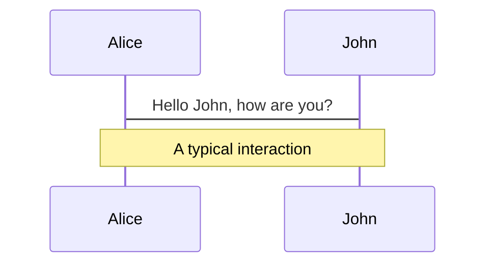
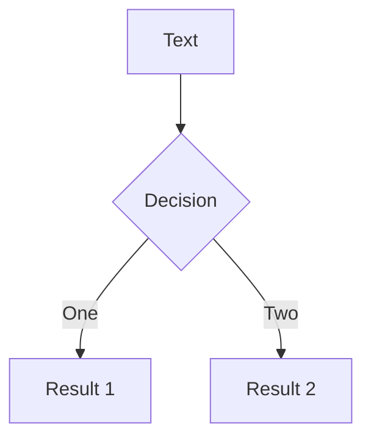
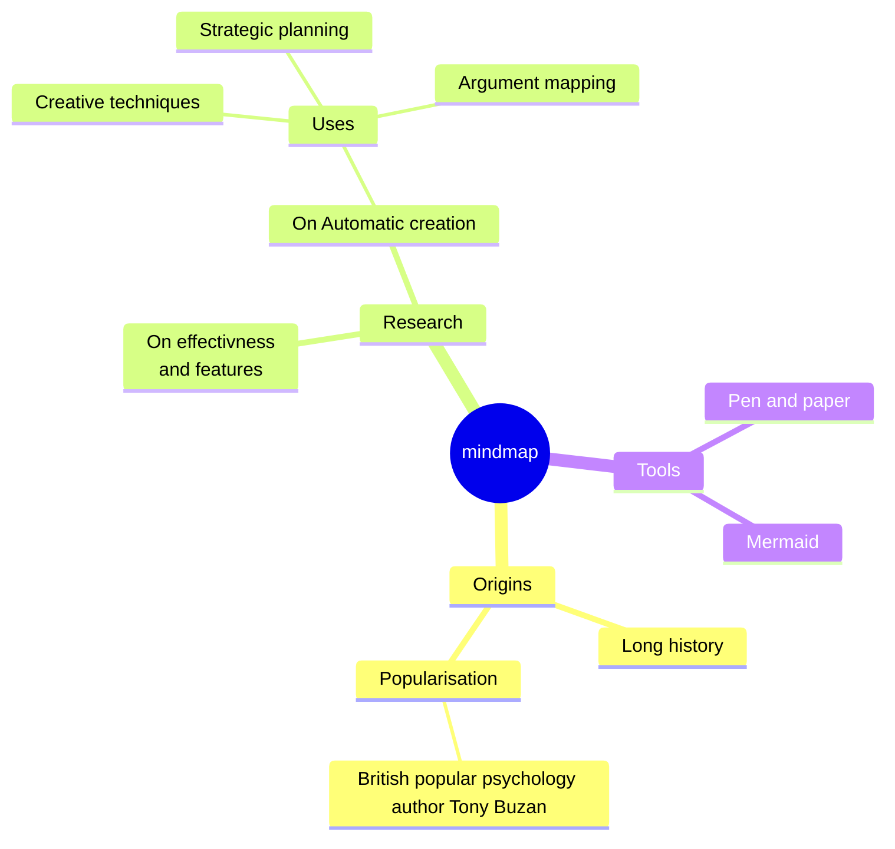
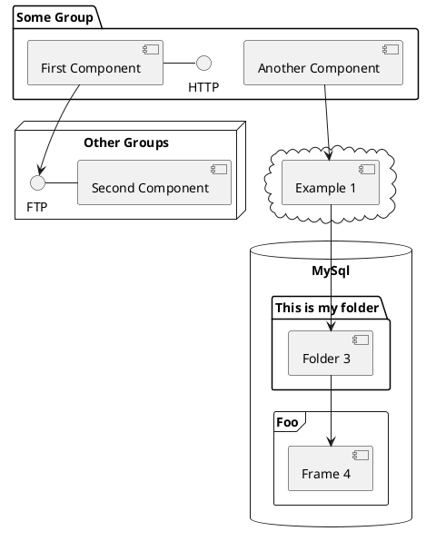

# Vue3 响应式系统和编译器初探

<div class="pt-12">
  <span @click="$slidev.nav.next" class="px-2 py-1 rounded cursor-pointer" hover="bg-white bg-opacity-10">
    Press Space for next page <carbon:arrow-right class="inline"/>
  </span>
</div>

<!--
The last comment block of each slide will be treated as slide notes. It will be visible and editable in Presenter Mode along with the slide. [Read more in the docs](https://sli.dev/guide/syntax.html#notes)
-->

---
layout: center
transition: fade-out
---

# 响应式系统

---
layout: default
---

## 什么是响应式？

考虑下面的代码:

```js
let a = 1
let b = 2
let sum = a + b

console.log(sum) // 3

a = 2
console.log(sum) // 还是 3
```

可以看到，修改 a 的值，sum 并没有自动发生任何改变，`sum = a + b` 并没有重新执行。

现在我们考虑将它包装成一个函数：

```js
function update() {
  sum = a + b
}
```

---
---

然后我们定义一些新术语:

- `update()`: 产生副作用的函数，简称副作用函数，它会修改了 sum 的状态
- `a` 和 `b`: 副作用函数的依赖

同时，假设还存在一个魔术方法 `whenDepsChange`，当依赖 a 和 b 发生变化时，重新执行 update 方法

```js
whenDepsChange(update)
```

完整伪代码如下:

```js
let sum
let a = 1
let b = 2
sum = a + b // 3
console.log(sum) // 3

whenDepsChange(function update() {
  sum = a + b
})
a = 10 // 修改 a 的值, 我们期待会重新执行 update 方法，并且 sum 的值变为 12
```

---
---

当然这一切都是做了一些假设的条件下才成立的，真实的 JavaScript 可没有魔术方法 `whenDepsChange`。

那我们可以使用 JS 语言的特性来实现这个魔术方法吗？

当然，接下来我们来了解下如何实现响应式数据。

---
layout: default
---

## 如何实现响应式数据

我们知道，在 ES6(ES2015) 之前，如果想拦截数据的读取和赋值操作，只能使用 `Object.defineProperty()` 将对象属性转换为 getter / setter 的形式，这也是 Vue2 所采用的方式，但是在 ES6+ 中，我们可以使用代理 `Proxy` 来实现对数据的拦截。

[简单了解下 Proxy & Reflect](https://w2xi.github.io/vue3-anaysis/proxy-and-reflect.html)

现在我们重新定义一些术语:

- 副作用函数 `effect`，即执行 `effect` 函数会产生副作用
- 响应式数据: 数据发生变化会自动执行副作用函数 `effect`

```js
// 执行 effect 会产生副作用
function effect() {
  document.body.innerText = 'hello vue3'
}
```

---
---

考虑下面的代码：

```js
const data = { text: 'Hello' }
const obj = new Proxy(data, {
  get(target, prop, receiver) {
    return Reflect.get(target, prop, receiver)
  },
  set(target, prop, value, receiver) {
    return Reflect.set(target, prop, value, receiver)
  }
})
function effect() {
  document.body.innerText = obj.text // 读取操作
}
// 执行副作用函数
effect() 
// 赋值操作
obj.text = 'Hello Vue3!'
```

现在问题变成: 当修改 `obj.text` 的值时，如何才能重新执行副作用函数 `effect` ?

---
---

假设有一个`桶`，当我们读取

---
layout: image-right
image: https://source.unsplash.com/collection/94734566/1920x1080
---

# Code

Use code snippets and get the highlighting directly![^1]

```ts {all|2|1-6|9|all}
interface User {
  id: number
  firstName: string
  lastName: string
  role: string
}

function updateUser(id: number, update: User) {
  const user = getUser(id)
  const newUser = { ...user, ...update }
  saveUser(id, newUser)
}
```

<arrow v-click="[3, 4]" x1="400" y1="420" x2="230" y2="330" color="#564" width="3" arrowSize="1" />

[^1]: [Learn More](https://sli.dev/guide/syntax.html#line-highlighting)

<style>
.footnotes-sep {
  @apply mt-20 opacity-10;
}
.footnotes {
  @apply text-sm opacity-75;
}
.footnote-backref {
  display: none;
}
</style>

---

# Components

<div grid="~ cols-2 gap-4">
<div>

You can use Vue components directly inside your slides.

We have provided a few built-in components like `<Tweet/>` and `<Youtube/>` that you can use directly. And adding your custom components is also super easy.

```html
<Counter :count="10" />
```

<!-- ./components/Counter.vue -->
<Counter :count="10" m="t-4" />

Check out [the guides](https://sli.dev/builtin/components.html) for more.

</div>
<div>

```html
<Tweet id="1390115482657726468" />
```

<Tweet id="1390115482657726468" scale="0.65" />

</div>
</div>

<!--
Presenter note with **bold**, *italic*, and ~~striked~~ text.

Also, HTML elements are valid:
<div class="flex w-full">
  <span style="flex-grow: 1;">Left content</span>
  <span>Right content</span>
</div>
-->


---
class: px-20
---

# Themes

Slidev comes with powerful theming support. Themes can provide styles, layouts, components, or even configurations for tools. Switching between themes by just **one edit** in your frontmatter:

<div grid="~ cols-2 gap-2" m="t-2">

```yaml
---
theme: default
---
```

```yaml
---
theme: seriph
---
```


</div>

Read more about [How to use a theme](https://sli.dev/themes/use.html) and
check out the [Awesome Themes Gallery](https://sli.dev/themes/gallery.html).

---
preload: false
---

# Animations

Animations are powered by [@vueuse/motion](https://motion.vueuse.org/).

```html
<div
  v-motion
  :initial="{ x: -80 }"
  :enter="{ x: 0 }">
  Slidev
</div>
```

<div class="w-60 relative mt-6">
  <div class="relative w-40 h-40">
    
    
    
  </div>

  <div
    class="text-5xl absolute top-14 left-40 text-[#2B90B6] -z-1"
    v-motion
    :initial="{ x: -80, opacity: 0}"
    :enter="{ x: 0, opacity: 1, transition: { delay: 2000, duration: 1000 } }">
    Slidev
  </div>
</div>

<!-- vue script setup scripts can be directly used in markdown, and will only affects current page -->
<script setup lang="ts">
const final = {
  x: 0,
  y: 0,
  rotate: 0,
  scale: 1,
  transition: {
    type: 'spring',
    damping: 10,
    stiffness: 20,
    mass: 2
  }
}
</script>

<div
  v-motion
  :initial="{ x:35, y: 40, opacity: 0}"
  :enter="{ y: 0, opacity: 1, transition: { delay: 3500 } }">

[Learn More](https://sli.dev/guide/animations.html#motion)

</div>

---

# Diagrams

You can create diagrams / graphs from textual descriptions, directly in your Markdown.

<div class="grid grid-cols-4 gap-5 pt-4 -mb-6">









</div>

[Learn More](https://sli.dev/guide/syntax.html#diagrams)

---
src: ./pages/multiple-entries.md
hide: false
---

---
layout: center
class: text-center
---

# Learn More

[Documentations](https://sli.dev) · [GitHub](https://github.com/slidevjs/slidev) · [Showcases](https://sli.dev/showcases.html)
